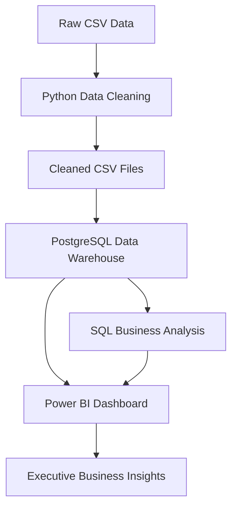
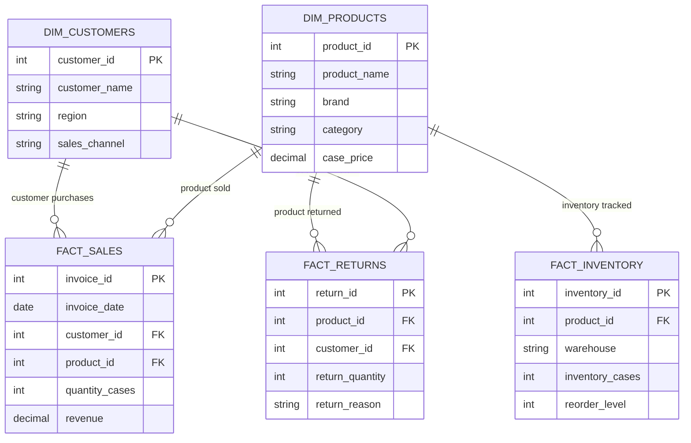

# Monster Energy Sales & Distribution Analytics

<p align="center">

An end-to-end Business Intelligence project transforming raw operational data into actionable business insights through Python, PostgreSQL, SQL, and Power BI.

</p>

---

## Project Overview


This project simulates a real-world analytics workflow for a beverage distribution company by transforming raw operational data into a structured analytical environment.

The solution includes:

- Data cleaning and validation using Python
- PostgreSQL data warehouse development
- Star schema data modeling
- SQL-based business analysis
- Executive dashboard reporting in Power BI

---

## Table of Contents

- [Executive Summary](#executive-summary)
- [Business Problem](#business-problem)
- [Project Objectives](#project-objectives)
- [Technology Stack](#technology-stack)
- [Project Structure](#project-structure)
- [ETL & Data Preparation](#etl--data-preparation)
- [Data Warehouse Design](#data-warehouse-design)
- [Business Analysis & Key Insights](#business-analysis--key-insights)
- [Dashboard Preview](#dashboard-preview)
- [Skills Demonstrated](#skills-demonstrated)
- [Future Enhancements](#future-enhancements)

---

# Monster Energy Sales & Distribution Analytics

## Executive Summary

This project demonstrates an end-to-end Business Intelligence solution designed to analyze sales, inventory, customer, and product performance for a fictional Monster Energy distribution network.

Starting with intentionally imperfect raw operational data, the project walks through the complete analytics lifecycle by cleaning and validating data with Python, loading it into a PostgreSQL data warehouse using a star schema, performing business analysis with SQL, and preparing the data for executive dashboard reporting in Power BI.

The objective is to simulate a real-world analytics workflow that transforms raw transactional data into actionable business insights for decision-makers.

---

## Business Problem

Monster Energy distributes products across multiple warehouses, sales channels, and customer types. Business leaders need reliable reporting to monitor revenue, inventory levels, product performance, customer activity, and product returns.

However, operational data often contains duplicate records, missing values, inconsistent product information, incorrect calculations, and other data quality issues that prevent accurate reporting.

This project demonstrates how an analyst can build a reliable reporting pipeline by cleaning raw operational data, designing a relational warehouse, validating business metrics, and delivering trustworthy analytics that support data-driven decisions.

---

## Project Objectives

- Clean and validate raw operational datasets using Python and Pandas.
- Design a dimensional data warehouse using a star schema.
- Load analytical tables into PostgreSQL.
- Develop SQL queries to answer business questions.
- Calculate executive KPIs and operational metrics.
- Build an interactive executive dashboard in Power BI.
- Demonstrate an end-to-end Business Intelligence workflow suitable for portfolio presentation.

---

# Technology Stack

| Category | Technologies |
|----------|--------------|
| Programming | Python |
| Data Processing | Pandas, NumPy |
| Database | PostgreSQL |
| Query Language | SQL |
| Business Intelligence | Power BI *(dashboard development)* |
| Development Environment | VS Code, Jupyter Notebook, Beekeeper Studio |
| Version Control | Git, GitHub |

---

# Project Structure

```text
Monster_Energy_Analytics/
│
├── dashboards/             # Power BI dashboard files
├── docs/
│   └── images/             # Dashboard screenshots and documentation images
│
├── data/
│   ├── raw/                # Original generated datasets
│   └── cleaned/            # Cleaned datasets used for loading
│
├── notebooks/
│   ├── 01_clean_customers.ipynb
│   ├── 02_clean_products.ipynb
│   ├── 03_clean_invoices.ipynb
│   ├── 04_clean_inventory.ipynb
│   └── 05_clean_returns.ipynb
│
├── sql/
│   ├── 01_create_tables.sql
│   ├── 02_load_data.sql
│   └── 03_business_queries.sql
│
├── README.md
├── requirements.txt
└── .gitignore
```

---

# Project Workflow

The project follows a complete Business Intelligence pipeline from raw data to executive reporting.

```text
Raw CSV Data
      │
      ▼
Python Data Cleaning
(Pandas)
      │
      ▼
Cleaned CSV Files
      │
      ▼
PostgreSQL Data Warehouse
(Star Schema)
      │
      ▼
SQL Business Analysis
      │
      ▼
Power BI Executive Dashboard
```

---

# ETL & Data Preparation

A significant portion of this project focuses on transforming imperfect operational data into a reliable analytical dataset.

Rather than assuming clean source data, each dataset intentionally contained common real-world data quality issues to simulate challenges frequently encountered in production environments.

The data preparation process followed a traditional Extract, Transform, Load (ETL) workflow.

## Extract

Raw CSV files were generated to represent operational data across multiple business functions, including:

- Customers
- Products
- Sales Invoices
- Inventory
- Product Returns

Each dataset intentionally included data quality issues such as:

- Duplicate records
- Missing values
- Invalid dates
- Incorrect revenue calculations
- Negative inventory quantities
- Negative sales quantities
- Missing customer references
- Missing product attributes
- Inconsistent product naming

---

## Transform

Each dataset was cleaned independently using Python and Pandas.

Cleaning activities included:

- Standardizing missing values
- Removing duplicate identifiers
- Correcting invalid quantities
- Recalculating revenue using business rules
- Validating foreign key relationships
- Standardizing product information
- Correcting pricing inconsistencies
- Converting data types
- Verifying data integrity through validation checks

Every cleaning step was documented inside Jupyter notebooks to provide a transparent and repeatable workflow.

---

## Load

After validation, the cleaned datasets were loaded into PostgreSQL using a dimensional data warehouse.

The warehouse follows a star schema consisting of:

### Dimension Tables

- dim_customers
- dim_products

### Fact Tables

- fact_sales
- fact_inventory
- fact_returns

This structure supports efficient aggregation and analytical reporting while maintaining clear relationships between business entities.

---

## Data Validation

Before analysis, several validation checks were performed to ensure data integrity, including:

- Duplicate key verification
- Null value validation
- Revenue calculation verification
- Inventory consistency checks
- Foreign key validation
- Product and customer relationship verification

These validation steps ensured that all analytical queries were built on trustworthy data.

---

# Data Warehouse Design

The project uses a dimensional data warehouse model designed to support business intelligence reporting and analytical queries.

The warehouse follows a **star schema design**, separating descriptive business information into dimension tables and measurable business transactions into fact tables.

This structure improves query performance, simplifies reporting, and allows business users to analyze sales, inventory, customers, and returns from multiple perspectives.

---

## Analytics Architecture



---

## Star Schema Architecture

```
                    dim_customers
                         │
                         │
                         ▼
dim_products ─────── fact_sales ─────── dim_date
                         │
                         │
                         ▼
                 fact_returns


                 fact_inventory
                         │
                         │
                         ▼
                  dim_products
```

---

## Entity Relationship Diagram

The database follows a star schema design optimized for business intelligence reporting.

The fact tables contain measurable business transactions, while dimension tables provide descriptive context for analysis.



## Dimension Tables

### dim_customers

Contains customer-level descriptive information.

Examples:

- Customer name
- Region
- Sales channel
- Customer segment

Used for analyzing:

- Revenue by region
- Sales channel performance
- Customer purchasing behavior

---

### dim_products

Contains product master information.

Examples:

- Product name
- Brand
- Category
- Flavor
- Pricing information

Used for analyzing:

- Product performance
- Brand revenue
- Product profitability
- Return trends

---

## Fact Tables

### fact_sales

Contains transactional sales data.

Key metrics:

- Revenue
- Quantity sold
- Discount percentage
- Case price

Supports analysis of:

- Sales performance
- Revenue trends
- Product rankings
- Customer purchasing activity

---

### fact_inventory

Contains warehouse inventory snapshots.

Key metrics:

- Inventory quantity
- Reorder levels
- Warehouse location

Supports analysis of:

- Inventory availability
- Warehouse performance
- Stock risk

---

### fact_returns

Contains returned product transactions.

Key metrics:

- Returned quantity
- Return reason
- Customer information

Supports analysis of:

- Product quality issues
- Return trends
- Operational improvements

---

# Business Analysis & Key Insights

The cleaned and validated warehouse was analyzed using SQL to answer key business questions related to revenue performance, product trends, customer activity, inventory management, and product quality.

The analysis focused on identifying patterns that could support operational decisions and strategic planning.

---

# Executive Performance Metrics

| Metric | Result |
|---|---:|
| Total Revenue | $526.96M |
| Total Cases Sold | 15.4M |
| Total Customers | 500 |
| Total Products | 34 |

These metrics provide a high-level overview of overall business performance and establish baseline KPIs for executive reporting.

---

# Revenue Performance

## Revenue by Region

The Midwest region generated the highest revenue contribution, followed by the West region.

Top performing regions:

1. Midwest
2. West
3. Northeast
4. South
5. Mountain

This analysis helps identify geographic markets contributing the greatest sales volume and opportunities for future expansion.

---

## Revenue by Sales Channel

Distributor sales represented the largest revenue channel.

Performance ranking:

1. Distributor
2. Retail
3. Grocery
4. Convenience

Understanding channel performance allows business teams to prioritize partnerships and optimize distribution strategies.

---

# Product Performance

## Top Performing Brands

Monster Ultra generated the highest overall revenue among product categories.

Top performing brands:

1. Monster Ultra
2. Monster Energy
3. Juice Monster
4. Reign
5. Java Monster

Product-level analysis identified high-performing SKUs and provided insight into consumer demand patterns.

---

## Top Revenue Products

The highest revenue-generating products included:

- Monster Energy Original
- Monster Energy Import
- Monster Energy Lo-Carb
- Monster Energy Zero Sugar
- Juice Monster Aussie Style Lemonade

These products represent key contributors to overall sales performance.

---

# Inventory & Operations Analysis

Warehouse inventory analysis identified distribution centers with the highest inventory levels and products requiring additional monitoring.

The analysis supports:

- Inventory planning
- Warehouse optimization
- Reorder decisions
- Supply chain visibility

---

# Product Return Analysis

Return analysis identified products with higher return volumes and evaluated return reasons.

Common return categories included:

- Quality Issues
- Expired Product
- Wrong Shipment
- Damaged Product
- Customer Complaint

These insights can help identify opportunities to improve product quality, fulfillment accuracy, and customer satisfaction.

---

# Business Impact

This project demonstrates how raw operational data can be transformed into actionable insights by combining:

- Data cleaning
- Database design
- SQL analysis
- KPI development
- Business intelligence visualization

The final solution provides a reliable analytical foundation for monitoring sales performance, identifying operational risks, and supporting data-driven decision-making.

---

# Dashboard Preview

The final stage of this project is an interactive Power BI dashboard designed to provide executive-level visibility into sales performance, product trends, inventory health, and return analysis.

The dashboard will transform the analytical outputs from PostgreSQL into visual insights that allow users to explore business performance across multiple dimensions.

---

## Executive Overview Dashboard

Provides a high-level summary of business performance.

Key metrics:

- Total Revenue
- Total Cases Sold
- Customer Count
- Product Count
- Monthly Revenue Trends
- Revenue by Region
- Revenue by Sales Channel

Preview:


---

## Sales Performance Dashboard

Focuses on understanding product and customer sales trends.

Includes:

- Top performing products
- Brand performance
- Customer revenue ranking
- Sales channel analysis
- Regional performance

Preview:


---

## Operations Dashboard

Provides visibility into inventory and distribution performance.

Includes:

- Inventory levels by warehouse
- Products below reorder thresholds
- Warehouse performance
- Inventory availability

Preview:


---

## Returns & Quality Dashboard

Analyzes product return activity and potential operational issues.

Includes:

- Return volume
- Return reasons
- Product return rates
- Quality issue trends

Preview:


---

# Skills Demonstrated

This project demonstrates an end-to-end Business Intelligence workflow, combining data engineering fundamentals, analytics, and visualization.

## Data Analytics

- Developed SQL queries to analyze sales, inventory, customer, and product performance.
- Created business KPIs to measure revenue, sales volume, customer activity, and operational performance.
- Translated analytical findings into actionable business insights.

---

## Data Cleaning & Transformation

- Used Python and Pandas to clean and validate raw operational datasets.
- Identified and resolved common data quality issues including:
  - Duplicate records
  - Missing values
  - Invalid transactions
  - Incorrect calculations
  - Data inconsistencies

- Built repeatable data preparation workflows using Jupyter Notebooks.

---

## Database Development

- Designed and implemented a PostgreSQL analytical database.
- Built a star schema data warehouse containing:
  - Dimension tables
  - Fact tables
  - Business relationships

- Loaded and validated cleaned datasets for reporting.

---

## Business Intelligence Development

- Designed dashboard requirements based on business questions.
- Prepared analytical datasets for Power BI reporting.
- Developed executive-level reporting focused on:
  - Sales performance
  - Product trends
  - Inventory management
  - Returns analysis

---

## Data Quality & Validation

- Performed validation checks to ensure analytical accuracy.
- Verified:
  - Foreign key relationships
  - Revenue calculations
  - Duplicate identifiers
  - Missing data
  - Transaction integrity

---

## Tools Used

- Python
- Pandas
- NumPy
- PostgreSQL
- SQL
- Power BI
- Jupyter Notebook
- Beekeeper Studio
- Git/GitHub

---

# Future Enhancements

While this project demonstrates a complete Business Intelligence workflow, there are several opportunities to expand the solution further.

## Data Pipeline Automation

Future improvements could include automating the data ingestion process by:

- Connecting directly to source systems or APIs
- Scheduling automated data refreshes
- Implementing workflow orchestration tools
- Reducing manual file-based ingestion

---

## Advanced Analytics

Additional analytical capabilities could include:

- Sales forecasting
- Demand prediction
- Customer segmentation
- Product recommendation analysis
- Seasonal trend analysis

These enhancements would provide deeper insights into future business performance.

---

## Enhanced Data Warehouse Development

The warehouse could be expanded by:

- Adding additional dimension tables
- Implementing a date dimension table
- Tracking historical changes using Slowly Changing Dimensions (SCD)
- Adding additional operational fact tables

---

## Dashboard Improvements

Future Power BI enhancements could include:

- Automated dashboard refreshes
- Additional drill-through reporting
- Executive alert notifications
- Forecasting visuals
- More advanced filtering capabilities

---

## Cloud Deployment

A future production version of this project could migrate to cloud technologies such as:

- Cloud-based databases
- Automated ETL pipelines
- Data warehouse platforms
- Enterprise reporting solutions

This would allow the solution to scale from a portfolio project into a production analytics environment.